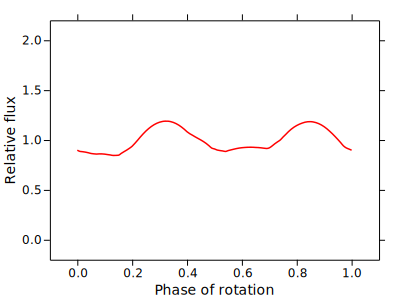
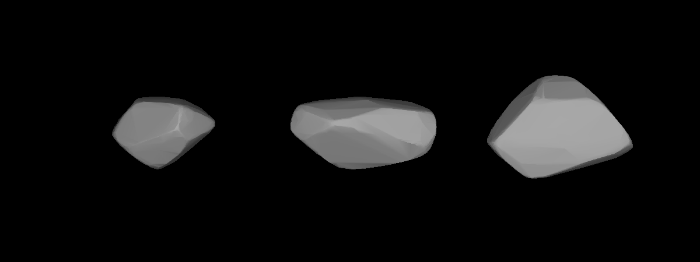
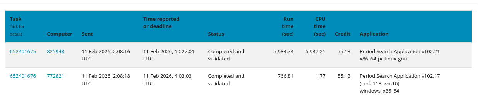

## Introduction

[In my previous article about LLM Tool development]() I tried to repurpose my 2011 Mac Mini to run local agents with Ollama. Unfortunately, I discovered too late that, while the machine could launch the models and use Ollama’s chat feature, it couldn’t execute my custom model inside the application. This was disappointing — I wanted a better excuse for keeping the computer running 24/7 — and ultimately, it was unfit for the task due to thermal constraints. So I started looking for something different to do and it ended up being quite a pleasant little journey.

## BOINC and the Project

Since I already determined that the server wasn't good enough for running AI applications I decided to switch the approach. I remembered that *Berkeley Open Infrastructure for Network Computing* (BOINC for short) existed, and it surprised me that it's still strong and ongoing, so I gave it a go.

The BOINC project is a piece of good old software that dates from 2002, and it was conceived as a network infrastructure for distributed computing. Basically, everyone can start a distributed computation project and people lend their machine when it's not in use to do scientific computing, or as the people say, to do some number crunching for science. The projects offered are from different scientific areas and from different countries, and they come and go when they are finished. Notable ones are Einstein@home (which studies gravitational waves), LHC@Home (to do processing for the Large Hadron Collider), SiDock@Home (drug discovery), and my favorite and the one I chose for this project, Asteroids@Home. But before diving into it, I had to fix a couple of issues with my little server.


## Server Issues

So, speaking of my little buddy, its only task these days is to host my [suwayomi instance](), since I moved out this blog to GitHub Pages at the start of the year to make management more handy. First, I tackled two of the ongoing issues before I started crunching. 


### Wifi issues

I found out the cause of the loss of connectivity on the server. It was something that bugged me for a while, because it was very periodic. Every Saturday, it suddenly disappeared from the network. Turns out the proprietary Broadcom driver, which has been unmaintained since the Pleistocene, seems to have a memory leak somewhere that was rendering my network service unusable on an oddly specific pattern. I tried investigating for a while, and then I gave up and used an external wifi antenna. I didn't need a fast network speed (it's not like this server can go faster than 100 Mbits/s) but a stable one.

### Thermal overheating

The machine overheats a lot under heavy load, and I could not replace the thermal paste (it's quite hard to disassemble, and I wasn't seeing it) but I eventually found the root cause: the fan wasn’t even trying. I found a little daemon called mbpfan that fixed all my thermal issues. This piece of software allows controlling the fans more precisely since the original fan module (AppleSMC). It turns out this module is not very optimized for Linux, and the fan doesn't really spin well under thermal stress. The project is [mbpfan](https://github.com/linux-on-mac/mbpfan), and I must say that is a fantastic piece of software.

Once I set up a config file, I was able to lower the working temperatures out of danger zone. To give some perspective, I executed the stress-test command to put it under some pressure. Without the fan config, this computer would reach around 90º C, and I managed to keep it using the same test at around 70 ºC.

To test it, I used stress-ng.

```bash
    stress-ng --cpu 1 --cpu-method matrixprod --timeout 60s
```

I set up a config file on /etc/mbpfan.conf For a more aggressive fan control:

```bash
min_fan1_speed = 1800	# put the *lowest* value of "cat /sys/devices/platform/applesmc.768/fan*_min"
max_fan1_speed = 5500	# put the *highest* value of "cat /sys/devices/platform/applesmc.768/fan*_max"

# temperature units in celsius
low_temp = 50			# if temperature is below this, fans will run at minimum speed
high_temp = 65			# if temperature is above this, fan speed will gradually increase
max_temp = 80			# if temperature is above this, fans will run at maximum speed
polling_interval = 2	# default is 1 seconds
```


## The Asteroids@Home Project.

Well, to dive into the project, it's very impressive.  I chose this project over the others for two reasons:

 - I Wanted a project that is handled from an European Institution, and this one is from the Charles University of Prague.
 - I needed a project that wasn't GPU oriented. There is a lot of projects that actually use CUDA, and mine doesn't even have a dedicated GPU. So I skimmed through the list to find one that was CPU bound.

The project goal is to study asteroids using photometry. According to the project documentation, big telescopes and backyard astronomers produce a huge amount of photometric data and identification of new asteroids, but we don't really know anything about the shape, the spin and the rotation period. 

The project actually uses a very clever solution in order to infer the unknown. By analyzing how brightness changes over time, the software simulates thousands of shapes. The project uses the Lightcurve Inversion Method. Imagine trying to guess the shape of a rotating object just by looking at how its brightness changes over time. Since we can't "see" the asteroid's surface directly, the software runs thousands of simulations, testing different shapes and spin axes until it finds one that matches the observed data.

So, for example, one asteroid I did some computing for (I think)



From this light curve — and thanks to the project — we got this probable 3D shape:



## Local Optimizations.

Even though BOINC allows to set preferences via website, which is super handy, I defined a global override locally to ensure that the file that rules all is mine. I created the config file /var/lib/boinc/global_prefs_override.xml with the following preferences.

```bash 

<global_preferences>
   <max_ncpus_pct>25.000000</max_ncpus_pct>
   <cpu_usage_limit>100.000000</cpu_usage_limit>
   <disk_interval>300.000000</disk_interval>
</global_preferences>

```

Basically, I set max_ncpus_pct to 25 to use only 1 core and a single thread on my mac mini (it's a dual.core, 4-thread microprocessor). This is needed to ensure that thermals are kept under control, and I can use the rest of the CPU for another project. CPU usage is at 100%, so I use the single thread all the time, and I set the disk interval to 300 seconds to avoid overusing my SSD.

With this configuration, I managed to drop the power usage under 20 W. I measured it using turbostat and I think it's a good approximation.

```bash

 sudo turbostat --Summary --quiet --show PkgWatt --interval 2

 ```


## Results

Well, how did it go? I must say I'm very impressed. From February 2 to February 11 (The day I'm writing this article) I completed 115 tasks (including 15 pending validation), which in return I earned 5,816 credits. Note that credits are basically monopoly money, so they are only to brag among your friends. There is a [ranking](https://boincstats.com) and some very hardcore people on it, but hey as they say, the most important thing is to participate.

I wanted to show something to prove my point:



In Asteroids@Home, tasks are given in pairs. In order to reach a quorum, both computers must reach the same result. In this case my computer first and the canonical result is the one I calculated first, but it took a long time. Tasks usually take about one and a half hours each. The other paired machine, got the task done in 12 minutes. We both got the same prize. We both contributed.


## Wrapping up

I totally had a blast doing this. I won't lie —I used the project as an excuse  to fix my ongoing issues and to justify keeping my server on—, but in the end I think I had a lot of fun. There is a lot of technical documentation about asteroids, and some very in-depth articles on how they do it. Actually, I tried to give a very lightweight version for the article, but since it's not my knowledge field, I didn't want to spread misinformation.


## Credits

This project and article were made possible thanks to the following open-source tools and scientific initiatives:

* **[BOINC](https://boinc.berkeley.edu/):** For providing the infrastructure that makes distributed volunteer computing accessible to everyone.
* **[Asteroids@home](https://asteroidsathome.net/):** Special thanks to the **Astronomical Institute of Charles University** in Prague for their incredible work in asteroid photometry and for maintaining such a welcoming project for the community.
* **[mbpfan](https://github.com/linux-on-mac/mbpfan):** A lifesaver for any Linux user on aging Mac hardware. Without this daemon, my Mac Mini would likely have melted by now.
* **[Fedora Project](https://getfedora.org/):** For delivering a rock-solid Server Edition (Fedora 43) that runs smoothly even on a machine from 2011.
* **[stress-ng](https://github.com/ColinIanKing/stress-ng):** For being the ultimate tool to test my thermal fixes and ensure system stability.

And finally, a huge shout-out to the **volunteer community**. Seeing other users' tasks (even those who crush them in 12 minutes!) is a great reminder that every single clock cycle contributed counts toward a larger goal.