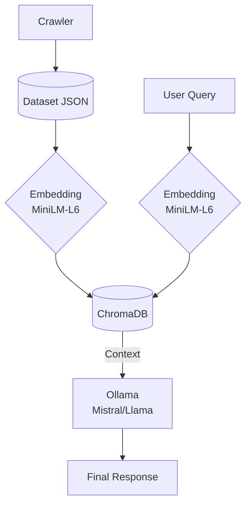

## Introduction 

Half a year ago, I started working in a different company. I was a bit stagnant on the previous one for different reasons, and ended up changing sector. Looking back, it was an intelligent choice, and quickly adapted to the new environment. I started doing AI-agent development and integrations, and I genuinely enjoyed the learning process. And what really piqued my interest was how AI was able to retrieve customized results there weren't in the training data: Retrieval-augmented generation.

In the meantime, I was enjoying my self-hosted manga reading instance when it struck me. I was running out of things to read, and my process for discovering new titles was slow: First, filtering tags. Then, reading synopsis one by one, and then choosing what actually sounds interesting and catches my attention.

My engineer’s intuition sensed this was a clear automation candidate... Specifically, a semantic search engine powered by an LLM.

## The Issue

OK, so we are getting somewhere. I thought about something:

  >How easily I can write a program that receives a user query, and finds the most similar books that match the query?
  
I did some research, and I made a list of the key components required:

1. A Crawler, or data Retrieval tool, to get information directly from the source, so we can build a dataset we can consult.
2. A Vector Database, to store and retrieve the data in a fast and organized way.
3. An Embedding model / query transformation to translate the user query into something that is actually intelligible to the database
4. An LLM / Generation model, to verbalize and reasons which results are actually related to the user query and generate a final output.

Then, I defined a few constraints for the project:

1. Everything must be open source.
2. Everything must run locally on my RTX 2060 (6 GB VRAM).
3. Processing times must be "reasonable" (taking into account my hardware limitations).

## Goal
Build a fully‑local, open‑source semantic search engine for manga that runs on a single RTX 2060 (≤ 6 GB VRAM) and returns ranked recommendations in a "reasonable" time.

## Architecture Overview

- **Crawler**: Queries Mangadex API and stores relevant manga data(synopsis, tags, author, artist, status of publication...) into `mangas_index.jsonl`.  
- **Embedding**: The selected embedding model (MiniLM‑L6‑v2 by default) transforms every register of the dataset into a 384 dimension vector.  
- **ChromaDB**: Stores the vectors and allows searches using cosine similarity.  
- **LLM (Ollama)**: Gets the top K closest results, filters using a user query and generates a list of 5 recommendations with reasoning.

## The Process
### Deciding the Core Tools

With that in mind, let's start with the easiest one: The Database. For this task, I chose ChromaDB because is an open source (Apache 2.0 license) non relational database that is designed specifically for storing embedding vectors, which actually are numeric representations of data in a multidimensional space. To put it simply, let's just say that anything can be converted into an N dimensional vector. Then this amount of numbers can be compared to other N vectors by similarity (a.k.a finding what is closest to it, using vectorial Algebra.)

Another advantage of ChromaDB is that it can be self-hosted, so I don't have to pay anything, And the cherry on top, turns out it has a great Python integration and documentation, so It's an obvious choice.

The embedding model that will work alongside ChromaDB is MiniLM-L6-v2. This is a lightweight model, that uses 384 dimensions and it's available on the python library called sentence-transformers. So, open source (Apache 2.0), and lightweight. Its task is to embed all data and user queries into vectors and then embed them into the database.

Then, we need an LLM. For this, I chose to run this using open source models locally. They must fit on my GPU, so bigger models are out of question. I settled for around 4.5 GB or so in order to have a bigger margin when running the models. After a lot of tinkering around, I ended up with 2 models: llama3:8b and mistral:7b-instruct-q4_K_M, both within the security size, and trained to follow instructions.

### The Workflow

How do all these pieces fit together? Let's look at it using real-world scenario: The general architecture is as follows:



Imagine a user provides the following input:

  > I want a realistic medical mystery manga where a doctor or forensic professional solves crimes using biology and medicine.

We already have the database: The crawler has requested data from mangadex and MiniLM has already converted all the data into 384 dimensional vectors and stored into the database using cosine similarity.

Now, we do the query. We must vectorize the user query. MiniLM converts the text into a vector, and we throw the query to the database. Chroma returns the top X results that are the most similar to the text input. In this case, I've set it to 15.

One important point: these results may or may not reflect the user’s true intent. Reading from the query is very obvious. What the user wants is a thematic search. It wants books that feature medical mysteries, such as forensic science, or something related to biological mysteries. The embedding model doesn't know this, it's just measuring similarity of words - essentially, how different two sentences are.

These results are fed to the LLM. Then, it will make a recommendation of 5 books, and give the pertinent reasoning on why they have been chosen.

Real output, using Llama3:

```
llama3:8b Response: Based on the font context and user context, I recommend the following 5 manga that best match the query:

**RESULT 1:** Trace (Koga Kei)
This medical mystery manga features a rookie forensic researcher who teams up with a renowned expert to solve crimes using biology and medicine. The tags "Thriller", "Crime", "Medical", and "Police" make it an excellent match for the user's request.

**RESULT 2:** Sono Mogari wa Netsu wo Shiranai (Nicomichihiro)
This manga tells the story of a trainee doctor who partners with a detective to investigate various cases. The tags "Mystery" and "Medical" align well with the user's query, making it a suitable recommendation.

**RESULT 3:** Shin Onna Kensatsui (YADA Akira)
Asuka Kamijo, a female medical examiner, solves murders by examining and dissecting bodies, using her unique skills to uncover the truth. The tags "Action", "Mystery" match well with the user's request for a realistic medical mystery manga.

**RESULT 4:** Diagnosis From a Fallen Angel (Tsukasa Shiori)
This thriller follows nurse Reiko Mikazuki as she delivers punishment to criminals in a general hospital where cunning and heinous criminals are treated. The tags "Thriller", "Psychological", "Crime", and "Gore" align with the user's query, making it an excellent match.

**RESULT 5:** Dr. Prisoner (Ishikawa Komatsu)
This medical suspense action manga features a doctor who is closer to death than anyone else, solving murders using his unique skills. The tags "Action", "Psychological", "Drama", and "Medical" align well with the user's request.

These five manga best match the user's query for a realistic medical mystery manga that does not involve supernatural powers or magic.
```

### About Results 

As you might have noticed, the query is a bit biased. I did a lot of tests with multiple queries, and I had to improve the general quality of the inputs. I had to add to the embedding data the synopsis, and then also a few tags and the author. This is because synopses alone are not enough to provide a good result. Sometimes synopses introduce a lot of noise and irrelevant text, and they actually don't match the tags at all. 

To demonstrate how the application works, I chose a very niche result in order to illustrate how the LLM filters the query results.

### Implementation Details

#### 1. Collection Creation on ChromaDB
```python

import chromadb

db_path = "./chroma_db" # example value
collection_name = "manga" # example value

client = chromadb.PersistentClient(path=db_path)
collection = client.get_or_create_collection(
    name=collection_name,
    configuration={"hnsw": {"space": "cosine", "ef_construction": 200}},
)
``` 

#### 2. Manga Indexing

```python
for line in f:
    data = json.loads(line)
    
    manga_id = data["id"]
    
    if manga_id in seen_ids:
        continue
    seen_ids.add(manga_id)
    ids.append(manga_id)
    title = str(data.get("title") or "N/A")
    author = str(data.get("author") or "N/A")
    artist = str(data.get("artist") or "N/A")
    status = str(data.get("status") or "N/A")
    tags = ", ".join(data.get("tags", []))
    year = str(data.get("year") or "N/A")
    
    document = f"Author: {author} tags: {tags} year: {year} synopsis: {data['description']}"
    # Add mangas info to lists
    documents.append(document)
    metadata.append(
        {
            "title": title,
            "author": author,
            "artist": artist,
            "status": status,
            "tags": tags,
            "year": year,
        },
    )
``` 
```python

from sentence_transformers import SentenceTransformer

BATCH_SIZE = 5000  # safe insertion for chroma.
embedding_model = SentenceTransformer("all-MiniLM-L6-v2") 

try:
    embeddings = embedding_model.encode(documents, normalize_embeddings=False)
    except Exception as exc:
        raise RuntimeError(
            f"Error encoding documents. Original error message: {str(exc)}"
        ) from exc
    print("Adding elements to collection")

    total_indexed = 0
    total_documents = len(documents)
    try:
        for i in range(0, total_documents, BATCH_SIZE):
            batch_end = i + BATCH_SIZE
            collection.add(
                ids=ids[i:batch_end],
                embeddings=embeddings[i:batch_end],
                documents=documents[i:batch_end],
                metadatas=metadata[i:batch_end],
            )
            total_indexed += len(ids[i:batch_end])
``` 

#### 3. User Vectorization and Database Querying

```python
import chromadb
from sentence_transformers import SentenceTransformer

db_path = "./chroma_db" # example value
collection_name = "manga" # example value
limit = 15 # results to retrieve
user_query = "I want a realistic medical mystery manga where a doctor or forensic professional solves crimes using biology and medicine."

query_embedding = embedding_model.encode(user_query).tolist()
client = chromadb.PersistentClient(path=db_path)
collection = client.get_or_create_collection(name=collection_name)
results = collection.query(
    query_embeddings=query_embedding,
    n_results=limit,
    include=["documents", "metadatas"],
)
``` 

#### 4. LLM Prompt

```python

from string import Template

BASE_PROMPT = Template(
    """
        # Role: Expert librarian, specialized in manga research. Based on the following context:

        ## User context
        $user_query

        ## Font context
        $result

        # Instructions
        Your task is to **analyze all manga descriptions and tags** provided in the Font context. From that analysis,
        select the 5 manga that best match the User context and elaborate a short description on them.

        # Response Rules
        - You will have to provide an accurate recommendation based on font context and user context *only*
        - **Output Format:** Present each of the 5 results clearly, detailing their Title and Author, and include a brief summary (1-2 sentences)
        explaining why they match the user's query.
        - Tags and manga descriptions must be taken into account.
        - Tags must have more priority than description in evaluations.
        - If result is not conclusive  you must say so.
        - **CRITICAL RULE: DO NOT INVENT FACTS.** If a user requirement is not explicitly mentioned, you MUST NOT include it in your justification.
        - Direct responses only, without preambles, goodbyes and extra info.
        - Tone must be neutral and objective
        - Speak in english
        """
)

``` 
### Some Considerations

You might be wondering: why use two different models? The main reason is Separation of Concerns.

The embedding model is a specialist: it is only responsible for vectorization. Both ChromaDB and the embedding model produce deterministic results (input A always produces B), but mathematical proximity doesn't always guarantee human relevance. This is where the LLM comes in.

To illustrate this, let’s look at a typical user query:

    "I want a realistic medical mystery manga where a doctor solves crimes using biology. It must be strictly realistic: NO ghosts, NO spirits, NO supernatural powers, and NO magic."

This is a "noisy" input. It’s full of negative constraints. Here lies the problem: Unless you are filtering metadata explicitly, an embedding model struggles to distinguish between "NO ghosts" and "YES ghosts". To the math, both sentences are semantically related to "ghosts".

As we have established in the previous section, we are actually measuring is How similar is the user’s string to my vectorized data? Without the LLM acting as a "reasoning filter" at the end, the system might retrieve a supernatural manga simply because the word "ghost" appeared in the query.

Here are some raw outputs produced before the LLM step: 

  > [RESULT 1] Trace (Koga Kei). Tags: Thriller, Crime, Sexual Violence, Medical, Police, Mystery. Author: Koga Kei tags: Thriller, Crime, Sexual Violence, Medical, Police, Mystery year: 2016 synopsis: A crime suspense story set in a forensic laboratory where specialists work to uncover clues from seemingly insignificant bits of trace evidence. The story begins when Sawaguchi Nonna, a rookie forensic researcher, meets Mano Reiji, the man who solved her parents' murder case.


  > [RESULT 13] Mail (Yamazaki Housui). Tags: Thriller, Ghosts, Crime, Survival, Drama, Horror, Police, Supernatural, Mystery, Tragedy. Author: Yamazaki Housui tags: Thriller, Ghosts, Crime, Survival, Drama, Horror, Police, Supernatural, Mystery, Tragedy year: 1999 synopsis: Private detective Reiji Akiba has a theory about those awkward moments and weird coincidences we all encounter in life. They are actually encounters with the dead; their way of sending us a message. But you may not want to open such strange mail from beyond - not unless you can see the ghostly attachment, like Akiba can. And not unless you carry a gun that can kill what isn't alive, like Akiba's aptly named Kagutsuchi, "the tool between God and earth"… digging a divine grave to lay to rest the evil dead.

As you can see, the first result is the expected one. The second one, not so much. So in reality, the task of the LLM is to filter some of the results according to the user query. To get the best output, the query often requires some prompt tuning, moving away from natural conversational phrases towards a more keyword-centric or 'taggy' approach to minimize vector noise. For example:

```text
--- Manga recomendation expert initializing ---
Loading embedding model: all-MiniLM-L6-v2...
Searching for: 'mystery detective agency supernatural ghosts murder police investigation'

llama3:8b Response: Here are the 5 manga recommendations that best match the User context:

1. **Kyuubi - Choujou Jiken Taisakuka** by Nishijima Keita: This mystery manga features a man investigating paranormal phenomena, which aligns with the user's interest in supernatural mysteries.
2. **Ryoko's Case File** by Tanaka Yoshiki (田中芳樹): As an elite investigator, Ryoko Yakushiji solves bizarre and supernatural cases, making this manga a great match for the user's query.
3. **Mail** by Yamazaki Housui: With its focus on ghostly attachments and the protagonist's ability to see and interact with them, Mail is a great fit for the user's interest in supernatural mysteries.
4. **Genshou X: Choujou Genshou Sousaroku** by Onsen Nakaya: This manga explores paranormal events and crimes that defy logic, making it a suitable match for the user's query.
5. **Shikigami Twilight Days** by Iwashiro Toshiaki: As a one-shot manga about supernatural sleuthing, Shikigami Twilight Days aligns with the user's interest in mysteries involving ghosts and the paranormal.

Note that these recommendations are based solely on the provided font context and do not incorporate any external knowledge or assumptions. 
``` 

In this case, I provided a tag input, and they match quite well. 

Let's add counterexamples that don't work so well to illustrate some future improvements. Here is a real unedited output from the system:
```text
--- Manga recomendation expert initializing ---
Loading embedding model: all-MiniLM-L6-v2...
Searching for: 'Author: Gosho Aoyama. Context: Mystery mangas investigation police thriller and crimes'

llama3:8b Response: Based on the font context, I recommend the following 5 manga that best match the User context:

1. **Detective Conan Special** by Gosho Aoyama: This manga is a spin-off series of short stories and cases from the Detective Conan universe. It features a high school detective who solves mysteries while investigating an organization that put him in this situation.
2. **Mori no Asagao Bangaihen - Shinjin Keimukan to Aru Shikeishuu no Monogatari** by Gouda Mamora: This manga is a side-story of the award-winning manga Mori no Asagao, which explores the issues of the death penalty through the friendship between a prison officer and an inmate on death row.
3. **Ice Blade: Diablo** by Takahashi Tsutomu: This manga features the case files of detectives at the Shinjuku Police Station, depicting the worst of human nature and the people that are the products of it.
4. **Akechi** by Iizuka Keita: This manga is a modern reimagining of the Edogawa Ranpo series, featuring a used bookstore owner who helps his childhood friend and detective solve crimes in Tokyo.
5. **Detective Story (Abe Yutaka)** by Abe Yutaka: This manga follows a young high school detective named Momoko Aoyama as she solves smaller, episodic cases since she took over her father's detective agency.

These recommendations are based on the tags and descriptions provided in the font context, which highlight themes of mystery, crime, police, and thrillers. 
```
```text
--- Manga recomendation expert initializing ---
Loading embedding model: all-MiniLM-L6-v2...
Searching for: 'Author: Naoki Urosawa. Context: Mystery mangas investigation police thriller and crimes'

llama3:8b Response: Based on the analysis of manga descriptions and tags provided in the Font context, I recommend the following 5 manga that best match the User context:

**1. Sneeze!: Naoki Urasawa Story Collection (Urasawa Naoki)**
This collection of short stories by Naoki Urasawa matches the user's query due to its thriller and mystery elements, which are common themes in Urasawa's works.

**2. Mujirushi - The Sign of Dreams (Urasawa Naoki)**
This miniseries also matches the user's query because it features a mix of thriller, comedy, crime, drama, and mystery elements, all hallmarks of Naoki Urasawa's style.

**3. Goodbye Mr. Bunny (Urasawa Naoki)**
Another work by Naoki Urasawa, this one-shot manga fits the user's query due to its action-packed storyline with elements of crime, drama, and police themes.

**4. DAMiYAN! (Urasawa Naoki)**
This one-shot manga also matches the user's query because it features a mix of thriller, comedy, crime, mafia, magic, gore, and fantasy elements, all common in Urasawa's works.

**5. Meitantei Shiro Series (Serizawa Naoki)**
This series fits the user's query due to its action-packed storyline with elements of comedy, police, and mystery themes, which are all reminiscent of Naoki Urasawa's style. 
```

For this last prompt, I've given names of famous authors. As you can see, the results for Aoyama Gosho are far worse from the ones of Urasawa Naoki, but both are quite bad. If you are familiar with these authors, you will realize that most of the important works are mostly missing. The LLM can't compensate for incomplete or incoherent data. It has a limited context window, and the dataset is what it is. A few future improvements can be improving the input descriptions or adding a **hybrid search** to combine the database results with traditional tag-filtering before the vector database retrieval and the final LLM response.

#### Filtering of Prohibited Terms
As stated previously, in this version the exclusion of words like *ghost*, *spirit*, *magic* or *supernatural* is delegated to the LLM via the prompt (see the previous noisy query from the previous section). A structured pre‑filter that removes any document whose `tags` contain those terms is planned for the next iteration.


### Benchmarks

| Metric              | Value           |
| ------------------- | --------------- |
| Collection          | `mystery_manga` |
| Total documents     | **9,143**       |
| Total indexing time | **33.685 s**    |

| Metric                                              | Value             |
| --------------------------------------------------- | ----------------- |
| Total query time                                    | **28.813 s**      |
| Chroma + model loading time                         | Included in total |
| Reasoning time with LLama3 (model already loaded on GPU) | **16.306 s**      |

Note: Reasoning time with a cold start takes an extra minute.

### Quality Assessment

I tested representative queries using different models (mistral 7b, Llama3 and phi3-mini), and the overall result is that there's no significant difference on reasoning between the 7B and 8B models (mistral7b and llama3). The reasoning time is also similar (between 16 and 20 seconds) and no relevant allucinations have been found. 8k Context windows are enough to fit 15 input synopses and generate 5 output results.

Regarding Phi3-mini (3B parameters) is not good enough to provide good reasoning, and it tends to allucinate information that is not found on synopsis, and it's heavily limited by the size of the model and its 4k context window.

Querying and embedding is 100% deterministic, I determined there is no significant difference between cosine and Euclidean embeddings due to the nature and length of the synopses in this dataset. Cosine similarity is mathematically equivalent to Euclidean distance when all vectors are L2-normalized (‖x‖ = 1). 

For normalized vectors, the identity ∥x−y∥² = 2−2cos(θ) shows that both metrics induce the same ordering: minimizing Euclidean distance ≡ maximizing cosine similarity

shows that both metrics induce the same ordering: minimizing Euclidean distance ≡ maximizing cosine similarity.
For the same query, the top 135 results out of 250 are returned on the same exact order, and variation of rest is +-1 positions. 


### Limitations

- Result quality heavily depends on the completeness of the tag metadata and synopses quality.
- No structured pre‑filter for prohibited words yet; we rely on the LLM.
- Only English/Japanese titles are supported; no multilingual handling yet.
- End‑to‑end latency (~20s) is acceptable but not ideal for real‑time UI

## Road Map

- [ ] Implement a deterministic pre‑filter for prohibited terms and to consider more results before the LLM step.
- [ ] Add few-shot examples to the prompt in order to teach the LLM what to reject.
- [ ] Implement a Hybrid search system, based on (BM25 maybe?)
- [ ] Hard metadata filtering. Configure ChromaDB to filter tags on database level to avoid giving all the responsibility to the LLM

## Quick‑Start
```bash
# Clone the repo
git clone https://github.com/MrCarri/semantic-manga-search.git
cd semantic-manga-search

# Set up a virtual environment
python -m venv .venv && source .venv/bin/activate
pip install -r requirements.txt

# Pull the Ollama models
ollama pull llama3:8b
ollama pull mistral:7b-instruct-q4_K_M

# Run the three scripts (check mangadex for a complete list of tags)
python scripts/crawler.py --included-tags "Mystery"
python scripts/indexer.py 
python scripts/query.py "realistic medical mystery manga with a doctor"
``` 
  
## License
This project is released under the MIT License. See the `LICENSE` file for details.

## Acknowledgements
- **ChromaDB** (Apache 2.0) – vector store.
- **Sentence‑Transformers / MiniLM‑L6‑v2** (Apache 2.0).
- **Ollama** (MIT) – local LLM serving.
- **Mangadex API** (CC‑BY‑NC‑SA) – source of manga metadata.

## References

- ChromaDB docs: https://www.trychroma.com/docs
- MiniLM‑L6‑v2 (Sentence‑Transformers): https://huggingface.co/sentence-transformers/all-MiniLM-L6-v2
- Ollama model catalog: https://ollama.com/library
- Mangadex API: https://api.mangadex.org/docs

## Wrap Up

So, to wrap up this article, we have a working architecture. A crawler, a vector database and LLM to filter. In theory, the system should work, taking user intent into account in addition to word-matching. In practice, the system is not perfect. As you might have noticed, the quality of the search results is closely related to the quality of the prompt. Actually, using a human-phrase input prompt leads to worse results. For example, if you start with "I want a manga that" if a vector contains this start, it will rank higher in the search even if it doesn't have any relation with the rest of the query. But overall, I think it's a fun experiment and was quite an enjoyable learning experience. 

You will have the whole source code on my [Github](https://github.com/MrCarri/semantic-manga-search), along with some instructions. In a future article, I want to work a bit on embedding and euclidean vs cosine searches, and some filtering. Stay tuned!

If you’d like to try the prototype yourself, fork the repo, open an issue with any bug you find, or submit a pull request with a new feature (e.g., hybrid search). Happy hacking!
