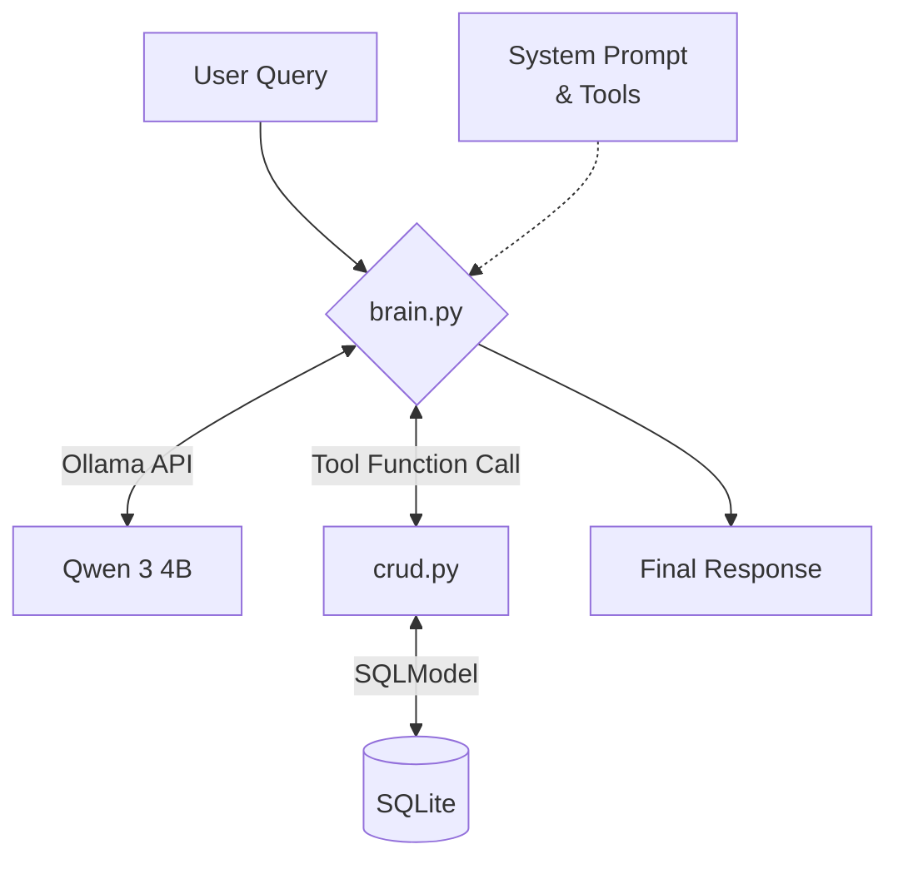

## Introduction

The other day I was pondering on AI tooling and I thought about something that I didn't know. How smart does an LLM actually need to be to reliably use function calling? At work, we take this for granted since we've been working on integrations with big models but that's not always the case.

Then, someone showed me an Instagram video about a workflow made with n8n, and I thought, does it have to be this way? It was a dead simple application, and it seemed a bit like a waste of a really powerful SaaS platform. Couldn't this thing be made locally for free or at least for a fraction of the cost? What is the smallest model capable of performing these tasks without losing its mind?

And the most important question is, can any computer run it?


## The issue

So, we have an idea. I decided on a calendar assistant, for the following reasons:

1. It's a simple workflow, and small LLMs are smart enough to do simple mechanical tasks.
2. The process is stateless. It doesn't need to retain memory of past requests
3. The answer must be delivered in a reasonable time: a calendar assistant should be snappy, not a 2-minute wait for a simple query

To keep the experiment grounded, I defined a set of constraints:

1. Fully open source.
2. Runnable in a CPU in a modern PC, at least.
3. Reasonable processing times.
4. Portable and callable as a Python library to be integrated with other applications.

To keep it simple, I defined 3 function tools. The Assistant will be able to:

1. Add new events to the calendar
2. List events on a closed time period.
3. Delete events by ID.

Note that I'm only allowing the deletion by giving an id number. This is a rule created in order to be super clear on what can be deleted. We don't want an LLM on a *rampage* deleting every event.

## The Laboratory: Hardware and Model Selection

I tested this setup on a modern PC, using the GPU for speed, but I kept the CPU constraints in mind. I also tested the models on my **2011 Mac Mini** to establish a more realistic "vintage" baseline. This little fella has an SSD and 8GB of RAM, and coincidentally, it features an i5 with the **Sandy Bridge** micro-architecture. This was the first Intel generation to support 256-bit vector processing (AVX), which significantly speeds up the math-heavy tasks common in AI/ML.

I hoped I could run my calendar assistant there, but—**Spoiler Alert**—it’s simply not enough for a real-time agent. It overheats quickly and enters thermal panic mode.

However, it can still handle Ollama's chat mode without much trouble. I used the `--verbose` option to get some measurements and set a baseline. I used a simple phrase to simulate input without any complex system prompt. If a PC from almost 15 years ago can output something, we can only go up from here.

### The Benchmark: Speed vs. Intelligence (Mac Mini 2011)

| Metric | Qwen 2.5 1.5B | Qwen 3 4B Instruct |
| :--- | :---: | :---: |
| **Total Response Time** | 5.99s | 12.50s |
| **Generation Speed (Eval)** | **8.40 tokens/s** | **3.51 tokens/s** |
| **Context Processing (Prompt)**| 13.19 tokens/s | 4.97 tokens/s |
| **Tokens Generated** | 25 tokens | 34 tokens |
| **Model Load Time** | 260ms | 347ms |

For the application, I left the door open to any Ollama-compatible model, but these four were the main candidates:

- **Llama 3.2 1B**
- **Llama 3.2 3B**
- **Qwen 2.5 1.5B**
- **Qwen 3 4B Instruct**

I had previously used Llama 3 for my RAG application, so I wanted to test the smaller siblings. I initially looked at Qwen 2.5 3B, but I was disappointed with the 3B version license. Luckily, **Qwen 3** was released 7 months ago with an **Apache 2.0 license**. I chose the **4B-Instruct** version, as it's specifically tuned for following directions and, crucially, for tool-calling we are about to implement.

### The Harsh Reality: 1 and 1.5b Models are Quite Dumb.

Don't get me wrong, they are cute and small, and they are able to answer quite a lot of questions. I created a small tool with ollama just to test if they were able to call the tool, and they *almost* were.

It's a curious experience, because I discovered that if I asked directly for the tool, they would at least attempt it. But with more complex natural language, they could not infer that the input was actually requesting to call a tool. They instead just hallucinate a plausible answer. 

In order to have *at least* some kind of consistency, I switched to the 3B and 4B models, and I was pleasantly surprised to see they were able to call tools, and the most important thing, they were able to infer that a tool was needed for a certain request.

After testing both models with the application, I settled on Qwen3 4B Instruct instead of llama3.2. Don't get me wrong, both models are an excellent fit for this application, but qwen3 is slightly more modern and specialized in following instructions and tool calling.

Before going into how they work, let's review the architecture of the project a little bit:

## The Architecture: A Layered Approach

To keep the project maintainable, I organized the agent into three distinct layers:

1.  **The Model Layer (`models.py`):** Here, I defined the data structures. Since we are dealing with a calendar, this file handles our events.
2.  **The Data Layer (`crud.py`):** This is the bridge between Python and SQLite. It follows the Repository Pattern, ensuring that the "Brain" doesn't need to know how to write SQL; it just calls functions like `add_event` or `list_events`.
3.  **The Brain (`brain.py`):** This is where the magic happens. It contains the System Prompt, the tool definitions, and the reasoning logic that handles the conversation loop with Ollama.

Note: I used [Typer](typer.tiangolo.com) (Try it, it's great!) to provide a bit of an interface. This application can be run standalone, or for example, a Telegram bot.

The general flow goes like this:



### Why this structure?

By separating the **CRUD** from the **Reasoning**, we solve two problems:
* **Testability:** I can test the database logic without firing up an LLM,
* **Flexibility:** If I want to switch from SQLite to PostgreSQL or change my System Prompt, I only need to touch one specific file. This also allows using the CRUD functionality without any LLM logic, allowing to use use the application from an LLM or from any interface.
* **Repeatability** Since the project is layered, it can be used as standalone application or as a part of a bigger one.

### Implementation Details

#### 1. Database Models

The implementation is super simple. We only need two tables, categories and events. I used SQLModel as ORM. As you can see, the database is on UTC timezone. This way, we don't have to worry here about Winter / Summer time adjustments. Regarding the Category class, this is chosen at LLM's discretion. It is up to the LLM to describe the category for the event, and I'm very happy that it's quite accurate.

```python

"""SQL model definition file."""

from datetime import datetime
from typing import List
from zoneinfo import ZoneInfo

from sqlmodel import Field, Relationship, SQLModel


class Event(SQLModel, table=True):
    """Table that stores events

    Attributes:
        id(int, optional): Autogenerated id for the entity.
        title(str): Event title.
        start_date(datetime): Start date of the event in UTC.
        end_date(datetime): end date of the event in UTC.
        category(int): category id of the event.
        category_model(Category): Category of the event.
    """

    id: int | None = Field(default=None, primary_key=True)
    title: str = Field()
    start_date: datetime = Field(
        default_factory=lambda: datetime.now(ZoneInfo("UTC")), index=True
    )
    end_date: datetime = Field(
        default_factory=lambda: datetime.now(ZoneInfo("UTC")), index=True
    )
    category_id: int | None = Field(
        foreign_key="categories.id", index=True, default=None
    )
    category_model: "Category" = Relationship(back_populates="events")
    __tablename__ = "events"  # type: ignore


class Category(SQLModel, table=True):
    """Table that stores event categories (e.g.: work, personal, groceries, etc)

    Attributes:
        id(int, optional): Autogenerated id for the entity
        name(str): Category unique name
        events(list): list of events associated with a category
            (this is to allow accessing to events from a category on reverse)
    """

    id: int | None = Field(default=None, primary_key=True)
    name: str = Field(unique=True)
    events: List["Event"] = Relationship(back_populates="category_model")
    __tablename__ = "categories"  # type: ignore

```
#### 2. The Calendar Repository

To interact with the database, I implemented a Repository Pattern. This layer is responsible for two things: executing the SQL and, more importantly, normalizing the data so the LLM can consume it easily.

Since LLMs are text-based the repository doesn't just return raw objects; it returns clean, human-readable dictionaries and handles the conversion between UTC and local time on the fly.

##### Handling Uncertainty

One of the main challenges with Small Models is that they are quite bad at math sometimes. For instance, if the user says "Remind me to buy bread at 5 PM", the model might try to fill in the gaps for an end_date. I instructed the LLM to stop guessing end_dates, and just return an empty string. This way the logic can handle the rest.

I handled this by adding logic to the create_event method to assume a 1-hour duration if the end time is missing:

```Python

# snippet of the create_event method logic
start_date_utc = to_utc_naive(date_str=start_date)
if not end_date or not end_date.strip():
    end_date_utc = start_date_utc + timedelta(hours=1) # Default to 1 hour
else:
    end_date_utc = to_utc_naive(date_str=end_date)

```

##### Making Data "LLM-Ready"

When the LLM asks for events, We cannot just return a live database python object to the LLM. A good practice is to represent the data in a clear string format to "read" them. For example, the add_event function returns:

```Python

# How we present the data back to the Brain
formatted_results.append({
    "id": event.id,
    "title": event.title,
    "start": local_start.strftime("%Y-%m-%d %H:%M"),
    "end": local_end.strftime("%Y-%m-%d %H:%M"),
    "category": event.category_model.name,
})

```

#### 3. The Prompt Logic

As you can see on this python template, the system prompt must be very concise. This is because small language models need *very* clear and unambiguous instructions in order to be able to follow them precisely. If this tool was run on a bigger model, such as Gemini3 or chatgpt, it wouldn't need to be so specific, and probably with a few lines it would be enough.

There's also a few special rules worth explaining:

- The "COUNTING RULE" and "TRUNCATION IS FORBIDDEN" rules exist because small models tend to do shortcuts when presenting information. For example, imagine that you have two work meetings, one tomorrow, and another one this afternoon at a different hour. The SLM might write a mix of both events, or just list one because is not smart enough to identify them as different things. Adding these rules force the model to think about how many elements have been returned.

- Adding a special line for **nothing was found** is more important than it seems at first glance. If the rule is missing the model might have the temptation of being useful and might invent some events based on context or tool examples instead of just saying I found nothing. Even though the tool returns a special message when there's no event, the calendar agent role might push it in the wrong direction.


```python

  _PROMPT_TEMPLATE = Template(
        """
        # SYSTEM: Calendar Agent.

        # CONTEXT:
        - $current_datetime.
        - Timezone is Europe/Madrid.

        # TASK: Administer appointments only. Decline non-related questions, jokes or advice.

        # Tool Rules:
        - Use tools only for creating, listing or deleting events.
        - If no tool is needed, respond with plain text.
        - COUNTING RULE: If tool returns 4 items, you MUST output 4 lines. NEVER merge duplicates.
        - TRUNCATION IS FORBIDDEN: Do not summarize or skip events.
        - List in chronological order.
        - If no events found, return "No events found for this period."

        # Behavior Rules:
        - Be concise. Skip pleasantries.
        - If the request is unclear, briefly explain what you can do (e.g., "Tell me a date to check your schedule").
        - If error message, explain it in simple terms.
        - Use day numbers, never names (e.g. 2026-01-20, not Tuesday).

        # Format Rules:
        - NEVER output raw JSON. Always respond in plain text.
        - LIST FORMAT: ID: [event_id] - [YYYY-MM-DD] - Title (HH:MM - HH:MM)
        - For tool arguments, always use: YYYY-MM-DD HH:MM
        """
    )

```

##### Handling time

In order to provide the SLM with temporal awareness, we must inject the reference time into the prompt. I also opted to add the date for today, tomorrow and next monday to give more context and to help the SLM to make calculations. Knowing when today and tomorrow are, and also next monday it makes the llm able to deduce some of the days that are close to this dates, such as the day after tomorrow.

```python

 def _get_system_prompt(self) -> str:
        now = datetime.now()

        tomorrow = now + timedelta(days=1)
        next_monday = now + timedelta(
            days=((7 - now.weekday()) if now.weekday() != 0 else 7)
        )

        current_time_str = (
            f"Today is: {DAYS_EN[now.weekday()]} {now.strftime('%Y-%m-%d %H:%M')}. "
            f"Tomorrow is {DAYS_EN[tomorrow.weekday()]} {tomorrow.strftime('%Y-%m-%d')}. "
            f"Next week starts on {DAYS_EN[0]} {next_monday.strftime('%Y-%m-%d')}."
        )
        return self._PROMPT_TEMPLATE.substitute({"current_datetime": current_time_str})

```

##### The Tool Dispatcher

In order to execute tools, I had to implement a dispatcher function. Below there's a simplified example, but basically the Ollama python sdk will return a list of tools (with the string names) and we will have to call the tools manually.

This is a very simplified version, but I think it illustrates tool calling in a way that is easy to understand.

```python

# brain.py - Simplified Tool Execution
def execute_tool(tool_call, repository: CalendarRepository):
    name = tool_call.function.name
    args = tool_call.function.arguments

    if name == "add_event":
        return repository.create_event(**args)
    if name == "list_events":
        return repository.get_events(**args)
    if name == "delete_event":
        return repository.delete_event(**args)

```

### Putting the Agent to the Test

To verify the integration between Qwen 3 and our Calendar Repository, I ran several tests directly from the terminal using a typer interface. Here is how the agent handles different scenarios:

#### 1. Creating an Event (Natural Language Inference)

The model needs to calculate the date for "tomorrow" and handle the specific duration and start time requested.
```Bash

python src/main.py "Add appointment for tomorrow. 30 minutes duration, starts at 9 in the morning. Is a work meeting."

[*] Consulting AI... (qwen3:4b-instruct)...

    🤖 Assistant:
    ID: 4 - 2026-01-21 - Work Meeting (09:00 - 09:30)

```

#### 2. Deleting by ID (Safety First)

As defined in our rules, the model must use the unique ID to perform deletions, ensuring precision.

```Bash

python src/main.py "Delete doctor visit with id 3, not needed anymore"

[*] Consulting AI... (qwen3:4b-instruct)...

------------------------------
🤖 Assistant:
Event with ID: 3 (Doctor Visit) has been successfully deleted.
------------------------------
```

And, as explained, without id there's no deletion

```Bash

python src/main.py "Delete today doctor visit, not needed anymore."
[*] Consulting AI... (qwen3:4b-instruct)...

------------------------------
🤖 Assistant:
I cannot delete events without a specific event ID. Please provide the ID of the doctor visit you want to delete.
------------------------------
```

#### 3. Listing and Formatting

The agent must follow the LIST FORMAT strictly, showing all events for the requested period without merging duplicates. In this case, I added two similar events at the same date.
```Bash

python src/main.py "What do I have scheduled for today?"

[*] Consulting AI... (qwen3:4b-instruct)...
------------------------------
🤖 Assistant:
ID: 1 - 2026-01-20 - Buy coffee (19:00 - 20:00)
ID: 2 - 2026-01-20 - Buy tea (19:00 - 20:00)
------------------------------

```

### Quality Assessment

I tested a few more complicated examples, for example asking a bigger period, or adding events in three days. The SLM, in general, is able to calculate the date correctly. In order to get more precise dates, what works best is using numbers instead of relative dates. This way, the possibility of the model to mistake the day of the week or the number is greatly reduced.


### Limitations

- Context blindness: Since we are keeping the process stateless to save on memory and complexity, the agent doesn't remember anything about previous messages.
- While Qwen 3 4B is remarkably smart for its size, it can still struggle with complex temporal logic (e.g., "Set a meeting for the first Tuesday of next month")


## Quick-Start

```bash
# Clone the repo
git clone https://github.com/MrCarri/smart-cal.git
cd smart-cal

# Set up a virtual environment
python -m venv .venv
source .venv/bin/activate  # On Windows use: .venv\Scripts\activate
pip install -r requirements.txt

# Pull the Ollama models
# We use Qwen3 for its good tool-calling capabilities in small sizes
ollama pull qwen3:4b-instruct

# Initialize the database and run the assistant
# You can pass your query directly as an argument
python src/main.py "Schedule a meeting with the design team tomorrow at 10am"

# List your events for today
python src/main.py "What do I have scheduled for today?"
```

## License
This project is released under the MIT License. See the `LICENSE` file for details.

## Acknowledgements

This project wouldn't have been possible without the incredible work of the open-source community. Special thanks to:

* **The Qwen Team (Alibaba Cloud):** For releasing **Qwen 3**, a model that finally brings reliable tool-calling to the "small model" category under an Apache 2.0 license. 
* **The [Ollama](https://ollama.com/) Team:** For creating the most seamless way to run LLMs locally. Their Python SDK made the integration with our "Brain" layer a breeze.
* **Tiangolo ([Sebastián Ramírez](https://github.com/tiangolo)):** For [SQLModel](https://sqlmodel.tiangolo.com/) and [Typer](https://typer.tiangolo.com/). They made the database and CLI layers of this project clean, type-safe, and actually enjoyable to write.
* **The [n8n](https://n8n.io/) Community:** For the inspiration. While this project aims for a local alternative, their workflows set the bar for what modern automation should look like.

---

**Find the full source code and contribute here:**
[https://github.com/MrCarri/smart-cal](https://github.com/MrCarri/smart-cal)


## Wrap Up

So, to wrap up this article, we have built a working architecture. We have a python library that can be added to any tool. I made it so I could demonstrate a real world scenario. In addition to a calendar, this also serves as an example on how to integrate LLM to add to your processes or projects.

You will have the whole source code on my [https://github.com/MrCarri/smart-cal](https://github.com/MrCarri/smart-cal), along with some instructions. In a future article, I want to integrate it onto another tool.

If you’d like to try the prototype yourself, fork the repo, open an issue with any bug you find, or submit a pull request with a new feature. Happy hacking!
