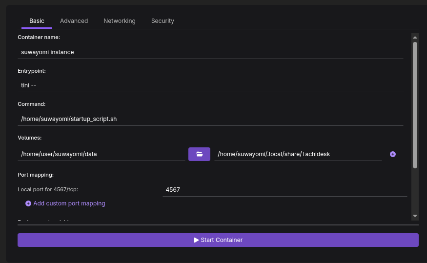
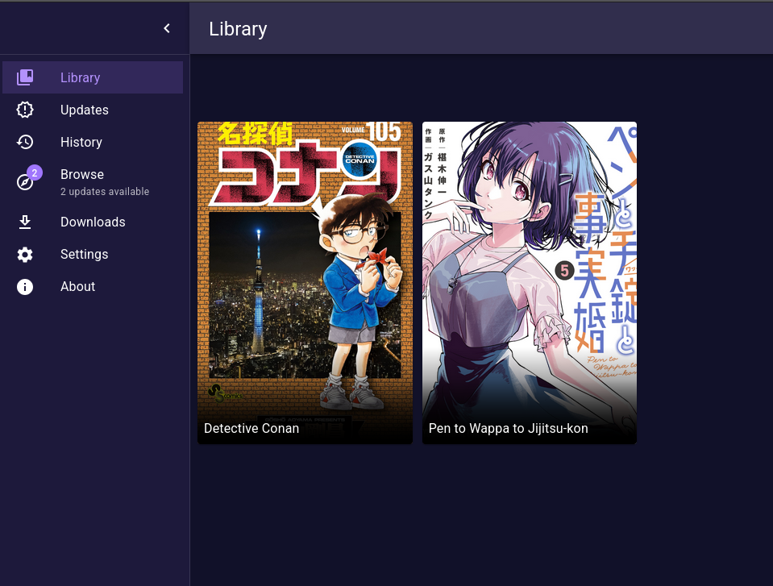

## The preamble

I like to read mystery manga as a hobby, and I have found myself in a point that I've read everything mainstream. The only thing left for me to do is to resort to more niche titles, such as the ones that are fan translated and never left Japan. And let's be honest, we all know how scanlation sites are. They are a mixed bag of scraped content from official sources, fan translations, scans taken directly from magazines in the eighties by publishers that went out of business in the nineties, and yes, a lot of porn.

Turns out that tracking your progress of everything you like is easy, thanks to pages like [myanimelist](https://myanimelist.net) or [anilist](https://anilist.co). What is actually hard is finding the chapters on the internet. They are distributed on private groups, reuploaded to sketchy ad filled websites with endless domains and the personal pages of fan translation groups.

Every now and then, a unicorn appears.
Sites like comick.io (RIP) or mangadex offer a clean reading experience, even better than the official ones with the possibility to get recommendations and also keeping track of your reading process. And the premise is great until copyright strikes, and the website fades out.

Even when the content is legit, these sites often get taken down entirely because they host a mix of all kinds of material.  
When that happens, **a lot of information and accessibility is lost.**

---

## The issue

So how do we attack this issue? Is there any way to mitigate this mess without getting into legal trouble? The answer lies in **Mihon** an open source app that is actually a client to read manga and track process.
Mihon is 100% legal, because it doesn't actually store any manga itself. Instead, it gets the content from *extensions*, which are actually small GitHub repositories that hold a list of sites where the app is able to fetch the manga from.

This is great... except the app is only for Android devices.
I like to read on my pc and also on my ipad while I'm relaxing, and while there are IOS alternatives, those apps are distributed as test applications using the official apple testing program, so they aren't easy to find, and also sketchy to use.

So, what can we do?

---

## The solution

### Suwayomi:

The answer is [Suwayomi](https://github.com/Suwayomi/Suwayomi-Server):

>A free and open source manga reader server that runs extensions built for Mihon (Tachiyomi).
>
>Suwayomi is an independent Mihon (Tachiyomi) compatible software and is not a Fork of Mihon (Tachiyomi).

That means we can run a **Mihon-compatible server locally**and can be accessed via any device on the local network, such as an iPad. It also comes with a web viewer, so it performs double functionality: fetching/storing manga and serving as a reader, which is really amazing. On top of that, if you like Mihon, is also compatible!

---

## What I did to set it up (using Podman)

To set it up, you can look up on the official documentation on github where executables are provided, and it's actually really easy to follow.
Just execute the java executable, and you are good to go, since it comes with a simple GUI that allows to configure some things. 

Since I wanted to do more configuration, and to be able to make this portable and isolated I took the containerized route. 

That way, I can later move the whole setup to a small home server without redoing the configuration.

### Podman vs Docker

I like using Podman for all my personal experiments, because I'm a big fan of how it works. 
Don't get me wrong, I use docker daily at work, but I personally dislike that running containers with root permissions is still the default option on Docker engine.

The setup was done on my personal machine, running Fedora 42.

If you already know how to use docker, then this article won't teach you anything new. I'm sure you will be able to follow it and replicate, since the process is the same. The only thing that changes is the engine behind it.

---

## The setup process

So, lets go to the process, since I already wrote a lot of things and still haven't started:

### Step 1 — Pull the image

I pulled the image from the official GitHub Container Registry:

```bash
podman login ghcr.io
podman pull ghcr.io/suwayomi/tachidesk:v2.1.1960

```

You’ll need a GitHub token to log in. Once done, the image will download as usual.


### Step 2 — Create a container with Podman Desktop

I opened podman desktop to create a new container from the pulled image. I clicked on containers, and I created one from the image I just pulled.


There, I changed the name, left the port as 4567 (the default is fine) and I added a few binds. This way I add my own local copies of mangas to it, and also I can backup in the case something happens.

```bash
    "/home/user/suwayomi/data:/home/suwayomi/",
    "/home/user/suwayomi/manga:/manga"
```




### Step 3 — Run and enjoy

And that’s it! Just run the container and access http://localhost:4567 to see your own instance running.

What's left now is to add your favorite Mihon compatible extensions (I won't provide any links for any github repository for the extensions, sorry!), and that's it!

I added a few mangas and everything is working perfectly. I also synchronized it with my personal account for Anilist, so I can update the tracking automatically.




## Wrap up

To summarize, Suwayomi is a fantastic option to store, read and organize your mangas locally, with full control and privacy. 
It’s easy to set up through the GUI, but it’s also flexible enough for Docker or Podman setups.

My next steps:

- I will move it into a dedicated server that is running 24/7 at home
- I want to setup a WireGuard-based VPN's or something like tailscale will make it accessible remotely so I can use it everywhere.

That's it! I hope you enjoyed the little journey, see you on the next one!